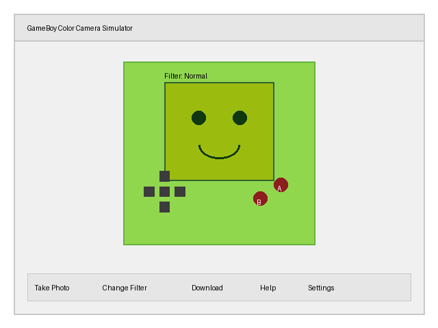
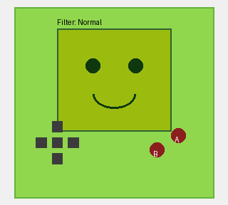
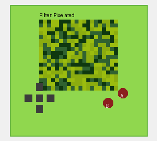
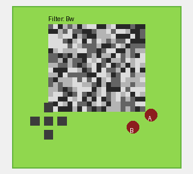
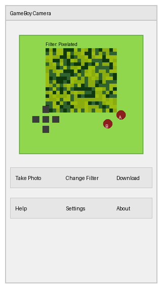

# GameBoy Color Camera Simulator

A web-based simulator that recreates the nostalgic experience of the GameBoy Camera using modern web technologies. This project allows you to use your device's camera with filters that mimic the iconic GameBoy Color aesthetic.

## Features

- **Authentic GameBoy Color Experience**: Recreates the look and feel of the original GameBoy Camera
- **Multiple Filter Modes**: GameBoy, Black & White, Pixelated, and Original
- **Photo Capture**: Take photos with a classic GameBoy-style flash effect
- **Download Functionality**: Save your retro-styled photos
- **Responsive Design**: Works on both desktop and mobile devices
- **Cross-Browser Compatibility**: Supports all modern browsers

## Screenshots

### Different Filter Modes

| GameBoy Filter | Pixelated Filter | Black & White Filter |
|:-------------:|:----------------:|:--------------------:|
|  |  |  |

### Mobile View

## Technical Details

### GameBoy Color Specifications

The simulator is designed to match the original GameBoy Color specifications:

- **Physical Dimensions**: 133.5 x 78 x 27.4 mm
- **Screen Resolution**: 160 x 144 pixels
- **Color Palette**: 
  - 32,768 possible colors (15-bit color depth)
  - Default GameBoy palette used:
    - Light green: #9bbc0f
    - Green: #8bac0f
    - Dark green: #306230
    - Very dark green: #0f380f

### Installation

1. Clone or download this repository
2. Open `index.html` in a web browser
3. Allow camera access when prompted

No additional dependencies or installation required!

### Usage Instructions

#### Controls

- **A Button / A Key**: Take a photo
- **B Button / B Key**: Change filter
- **START Button / Enter Key**: Download current photo
- **SELECT Button / Shift Key**: Show/hide help
- **D-Pad / Arrow Keys**: Navigate UI (for future features)

#### Taking Photos

1. Allow camera access when prompted
2. Select your desired filter using the B button
3. Press the A button to capture a photo
4. Press START to download your photo

## Browser Compatibility

The simulator has been tested and works on the following browsers:

| Browser | Version | Compatibility |
|---------|---------|---------------|
| Chrome  | 80+     | Full support  |
| Firefox | 75+     | Full support  |
| Safari  | 13+     | Full support  |
| Edge    | 80+     | Full support  |
| iOS Safari | 13.4+ | Full support |
| Chrome for Android | 80+ | Full support |

### Performance Considerations

- Automatically enables performance mode on mobile devices
- Reduces processing load on older browsers
- Implements specific fixes for iOS Safari

## Known Limitations

- Camera access requires HTTPS on most browsers
- Some older browsers may not support the MediaDevices API
- Performance may vary on lower-end devices
- iOS devices may have limited camera resolution control

## Implementation Details

### Core Technologies

- **HTML5**: Structure and semantic elements
- **CSS3**: Styling with responsive design
- **JavaScript**: Core functionality and camera interaction
- **MediaDevices API**: Webcam access
- **Canvas API**: Image processing and filters

### Key Components

- **Webcam Integration**: Uses MediaDevices.getUserMedia() API
- **Filter Processing**: Canvas-based pixel manipulation
- **Responsive Design**: CSS media queries and flexible layouts
- **Cross-Browser Support**: Includes polyfills and fallbacks

## Future Enhancements

- Additional GameBoy-inspired filters
- Gallery to view captured photos
- Face detection features
- Game-like interactions
- Social media sharing

## Credits and Acknowledgments

- Original GameBoy Color and GameBoy Camera by Nintendo
- Technical specifications from Nintendo documentation
- Color palette information from GameBoy development resources
- Inspired by the nostalgic 90s gaming experience

## License

This project is released as open source. Feel free to use, modify, and distribute as needed.

---

Created with ❤️ for retro gaming enthusiasts and web developers alike.